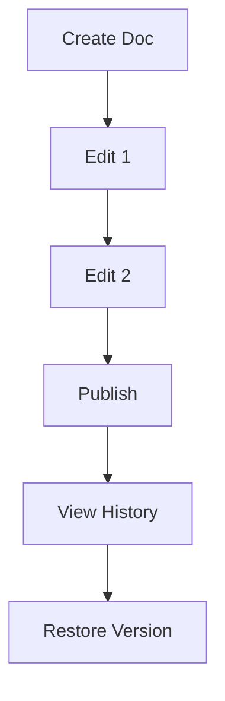

## Overview

Tomislav Soskic provides powerful tools to streamline your documentation workflow. You create, organize, edit, and collaborate on project docs with intuitive interfaces and robust features. Key capabilities include rich editing tools, hierarchical folder structures, integrated version control, and advanced search options.

<Columns cols={3}>
  <Card title="Rich Editing" icon="edit-3" href="#document-creation">
    Craft content with visual and code editors.
  </Card>
  <Card title="Smart Organization" icon="folder" href="#project-organization">
    Structure projects with nested folders.
  </Card>
  <Card title="Version History" icon="git-branch" href="#version-control">
    Track changes and revert effortlessly.
  </Card>
</Columns>

## Document Creation and Editing Tools

Start new documents quickly from the dashboard. Choose between visual WYSIWYG editor for non-technical users or Markdown mode for precise control.

<Steps>
  <Step title="Create Document" icon="plus">
    Click the `{New Document}` button. Enter a title like `API Reference` and select a folder.
  </Step>
  <Step title="Edit Content" icon="edit">
    Use the toolbar for headings, lists, and embeds. Switch to Markdown view for advanced formatting.
  </Step>
  <Step title="Preview and Publish" icon="eye">
    Preview changes in real-time, then hit `{Publish}` to make it live.
  </Step>
</Steps>

<Tabs>
  <Tab title="Visual Editor" icon="mouse-pointer">
    Drag-and-drop images and tables. Format text with familiar controls like bold (`**text**`) and italics (`*text*`).
  </Tab>
  <Tab title="Markdown Editor" icon="code">
    Write semantic Markdown. Supports frontmatter, code fences, and custom components.

````markdown
---
title: My Guide
description: Step-by-step instructions
---

## Introduction

Use `inline code` for variables like `{API_KEY}`.
````
  </Tab>
</Tabs>

<Callout kind="tip">
  Enable real-time collaboration by inviting team members. Changes sync instantly across editors.
</Callout>

## Project Organization and Folders

Organize docs hierarchically with unlimited nested folders. Assign permissions per folder for team access control.

| Feature | Description | Use Case |
|---------|-------------|----------|
| Nested Folders | Create subfolders like `docs/api/v1/` | Large projects with versioned APIs |
| Bulk Move | Drag multiple files at once | Restructuring after milestones |
| Searchable Tags | Add tags like `draft`, `published` | Quick filtering beyond folders |

## Version Control Basics

Every edit creates a snapshot. View history, compare diffs, and restore previous versions without external Git.



<CodeGroup tabs="CLI,API">
  ```bash
  # Fetch version history
  tsoskic docs history --project my-project --doc api-guide
  ```
  ```javascript
  // API call to list versions
  const response = await fetch('https://api.example.com/v1/docs/my-project/api-guide/versions');
  const versions = await response.json();
  console.log(versions);
  ```
</CodeGroup>

## Search and Filtering Options

Find content instantly with full-text search across all projects. Filter by tags, authors, or update date.

<ExpandableGroup>
  <Expandable title="Advanced Filters" default-open="true">
    Combine filters like `tag:draft author:john updated>2024-01-01`. Results update live as you type.
  </Expandable>
  <Expandable title="Saved Searches">
    Bookmark frequent queries, e.g., `{My Open Issues}` for docs with `status:open` tag.
  </Expandable>
</ExpandableGroup>

<Callout kind="success">
  Explore these features in your dashboard to boost productivity. Start with a test project today.
</Callout>