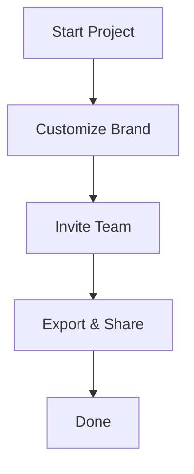

## Overview

Manage your projects efficiently in Tomislav Soskic by organizing documentation, inviting collaborators, exporting content, and customizing branding. This guide walks you through key workflows to keep your docs structured and accessible.

<Columns cols={3}>
  <Card title="Add Projects" icon="plus" href="#adding-projects">
    Create and categorize new projects quickly.
  </Card>
  <Card title="Manage Team" icon="users" href="#collaborators">
    Invite members and set permissions.
  </Card>
  <Card title="Export Docs" icon="download" href="#exporting">
    Share or backup your documentation.
  </Card>
</Columns>

## Adding and Categorizing Projects

Start by creating projects to group related documentation. Use categories like `API`, `Frontend`, or `Internal` for better organization.

<Steps>
  <Step title="Create Project" icon="plus">
    Navigate to the dashboard and click **New Project**.

    Enter a name like "User Authentication API" and select a category.
  </Step>
  <Step title="Add Files" icon="file-text">
    Upload MDX files or create new ones directly.

````markdown
---
title: Authentication Guide
description: Secure your API endpoints
---
```
````
  </Step>
  <Step title="Categorize" icon="tag">
    Assign tags such as `security` or `v1.0`.

    Save to see it in the project sidebar.
  </Step>
</Steps>

<Callout kind="tip">
  Use consistent naming like `{project}-{version}` for easy searching.
</Callout>

## Inviting Collaborators and Permissions

Control access by inviting team members. Define roles to manage edits and views.

<Tabs>
  <Tab title="Owner" icon="shield">
    Full control: edit, delete, invite others.

    Ideal for project leads.
  </Tab>
  <Tab title="Editor" icon="edit-3">
    Edit docs and manage files.

    ```bash
    # Example: Share edit link
    echo "https://dashboard.example.com/project/123/edit"
    ```
  </Tab>
  <Tab title="Viewer" icon="eye">
    Read-only access.

    Perfect for reviewers.
  </Tab>
</Tabs>

| Role    | Edit Docs | Delete Files | Invite Users |
|---------|-----------|--------------|--------------|
| Owner   | Yes       | Yes          | Yes          |
| Editor  | Yes       | No           | No           |
| Viewer  | No        | No           | No           |

<Callout kind="alert">
  Review permissions before inviting external collaborators to avoid unauthorized changes.
</Callout>

## Exporting and Sharing Docs

Export projects for backups or sharing. Options include PDF, HTML, or GitHub repo.

<Expandable title="Advanced Export Options" default-open="false">
  Use CLI for automation:

  <CodeGroup tabs="CLI,API">
  ````bash
  tomislav-export --project=auth-api --format=pdf --output=./exports
  ````
  ````javascript
  const response = await fetch('https://api.example.com/v1/export', {
    method: 'POST',
    headers: { 'Authorization': 'Bearer YOUR_TOKEN' },
    body: JSON.stringify({ projectId: '123', format: 'html' })
  });
  ````
  </CodeGroup>
</Expandable>

<Card title="Share via Link" icon="share-2" horizontal>
  Generate public links for Viewer access.
</Card>

## Customizing Brand Elements

Tailor your docs with custom colors and logos. Update the brand config to match `#3B82F6`.

<CodeGroup tabs="YAML,JSON">
```yaml
brand:
  color: "#3B82F6"
  logo: "/logo.svg"
```
```json
{
  "brand": {
    "color": "#3B82F6",
    "logo": "/logo.svg"
  }
}
```
</CodeGroup>



Apply changes site-wide via the settings panel. Test previews before publishing.